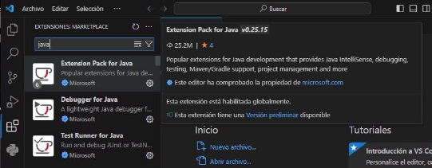
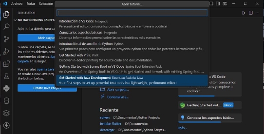
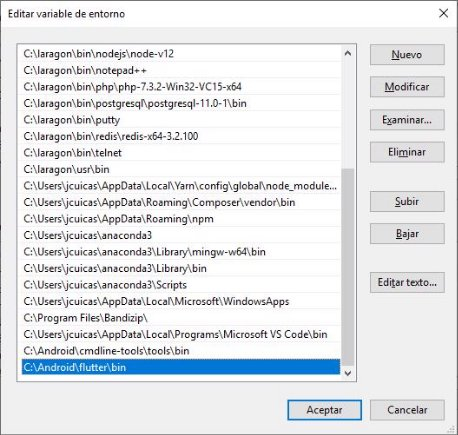
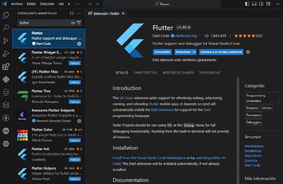
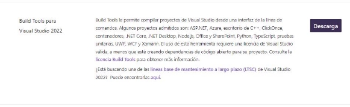

**Pasos para instalar Flutter y las herramientas necesarias para utilizar el SDK para crear aplicaciones móviles en Windows.** 

1. Descargar el Visual Studio Code desde la siguiente URL: 
    - [https://code.visualstudio.com/download ](https://code.visualstudio.com/download)

    

    - Luego Instalar el Visual Studio Code. 

2. Después de instalar abrir Visual Studio Code ir a la barra lateral izquierda y pulsar el icono de extensiones buscar java e instalar Extension Pack for Java. 

    

3. En la ventana de bienvenida de Visual Studio Code pulsar en la esquina inferior derecha el enlace de Más… y seleccionar Get Started with Java Development. 

    

4. Luego pulsar el botón Install el JDK (Java Development Kid), y seleccionar 17 (LTS) y pulsar el botón Download (Descargar). 

    

5. Al terminar la descarga ir a la carpeta de descargas e instalar OpenJDK17 

    

6. Descarga Git para Windows desde la siguiente URL: 

    - [ https://git-scm.com/downloads ](https://git-scm.com/downloads) 

    

7. Instalar Git para Windows. 
8. Descarga el SDK Flutter para Windows desde la siguiente URL:  

    - [ https://flutter.dev/docs/get-started/install/windows ](https://flutter.dev/docs/get-started/install/windows) 

    

    

9. Descarga Android Command Tools para Windows desde la siguiente URL: 

    - [ https://developer.android.com/studio/#command-tools ](https://developer.android.com/studio/#command-tools) 

    

10. Crea un directorio en tu unidad C: y colócale el nombre de Android 

    - C:\Android 

11. Extrae el archivo ZIP del SDK de Flutter en la carpeta **C:\Android**, en una subcarpeta llamada **flutter** la ruta completa se ve así: 

    - C:\Android\flutter 

12. Instala las Android Command Tools. Antes de extraer el archivo ZIP, crea una carpeta dentro de **C:\Android** con el nombre **cmdline-tools**, el directorio se ve así: 

    - C:\Android\cmdline-tools 

13. Dentro de ese directorio extrae el ZIP y renombra la carpeta extraída a **tools**, el directorio se ve así: 

    - C:\Android\cmdline-tools\tools 

14. Configure algunas variables de entorno: 

    

    - ANDROID\_HOME  

    

 
    - En el Path de variables de usuario o variables de sistema crear:  

    

    - En el Path de variables de usuario o variables de sistema crear: 

    

15. Para conocer Android API Levels visite la siguiente URL: 

    - [ https://apilevels.com/ ](https://apilevels.com/)

    

16. Descarga el SDK de Android. Para que Flutter funcione necesitamos instalar el SDK de Android y las API Levels, ejecute los siguientes comandos en la ventana de símbolo del sistema: 
    - sdkmanager “system-images;android-33;default;x86\_64” 
    - sdkmanager “platform-tools” 
    - sdkmanager “build-tools;33.0.0” 
    - sdkmanager “platforms;android-33” 
    - sdkmanager emulator 

17. Configurar la ruta del SDK para Flutter.
    - flutter config --android-sdk C:\Android\ 

18. Abrir Visual Studio Code buscar y descarga la extensión Flutter y Awesome Flutter Snippets. 

    

19. Descargar el Visual Studio Build Tools desde la siguiente URL: 
    - [https://visualstudio.microsoft.com/es/downloads/ ](https://visualstudio.microsoft.com/es/downloads/)
    - Buscar en la parte de debajo de la página. Herramientas para Visual Studio y descarga Build Tools para Visual Studio 2022. 

    

20. Instalar vs\_BuildTools 

    

21. Ejecución de Flutter Doctor. Ejecuta este comando: 

    - flutter doctor –v 

    

22. Si en este paso aún no se han aceptados las licencias utiliza el siguiente comando: 
    - flutter doctor --android-licenses 
    - presione ***y*** luego ***Enter*** para cada licencia. 

*Este comando te da una tilde verde para indicar lo que tienes instalado y listo para usar.*  

**Nota:** Personalmente prefiero ejecutar una aplicación para Android en un dispositivo físico si tu pc tiene  bajas  especificaciones  o  si  necesitas  construir  la  aplicación  rápidamente  porque  en  el emulador  tu  PC  consumirá  mucho  R.A.M  mientras  ejecute  el  emulador  y  será  muy  lento  el desarrollo. 

**Extra:**  En  tu  Smartphone tienes  que  ir  a  Configuración  activar  las opciones  de   desarrollador. Después activar la Depuración USB. Luego activar Instalar vía USB y por ultimo desactivar Verificar aplicaciones por USB. Para usar tu Smartphone como dispositivo físico.
